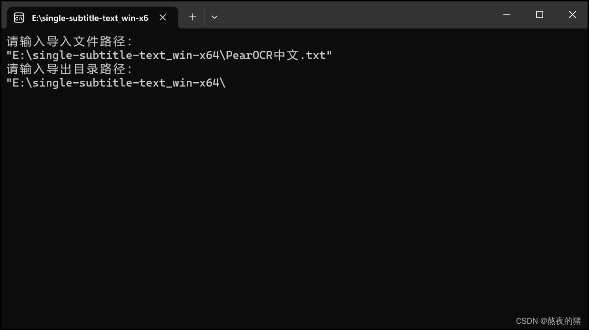

jre-17.0.7_win-x64的生成方式：

以管理员方式运行PowerShell执行命令：

cd $env:JAVA_HOME

jlink --no-header-files --no-man-pages --compress=2 --strip-debug --add-modules java.base,java.xml,java.desktop,jdk.management.agent --output E:\jre-17.0.7_win-x64

内部参数：

java -Dfile.encoding=UTF-8 -jar single-subtitle-text-1.0.0.jar

也可到本人博客查看教程：

https://blog.csdn.net/CJ_L1995/article/details/130577720

使用教程：

注意该图片的两个文件夹，都在下面这个软件的安装目录中。

VideoSubFinderWXW 拿来做字幕图片截取捕获，这是下载地址：

https://sourceforge.net/projects/videosubfinder/

下载安装完成后，步骤：打开视频框选字幕位置，清空所有图片（之前识别的图片），开始识别。

捕获完在安装目录图片所示的第一个文件夹RGBImages中，PearOCR可以安装成浏览器应用可以离线识别，pearOCR官网如下：

https://pearocr.com/#/

上传RGBImages所有图片识别完后导出为txt。(如果后续出现问题，文件路径及文件名不建议带有中文)

接下来是我开发的小工具（代码已开源到github上），下载地址如下，

Release single-subtitle-text-1.0 · LCJamI/single-subtitle-text · GitHub

下载single-subtitle-text_win-x64.zip解压，看到single-subtitle-text_win-x64.exe。

打开single-subtitle-text_win-x64.exe，根据提示输入该txt文本文件路径和输入安装目录图片所示的第二个文件夹TXTResults的路径，生成相应的TXTResults后

点击软件ocr菜单中的这个即可生成你想要的视频字幕了，贡献给所有做视频的朋友，市面上做这个的基本都收费，特别视频多且视频时长 长的工作，可以带来助力，大大缩短工作时长，但毕竟ocr识别不是完全准确的，还是需要一些人工审核。虽然意义不是很大但是对同声传译的视频提取字幕，新闻传播类等的二次制作等有帮助，以及博主不知道的领域等有帮助。
